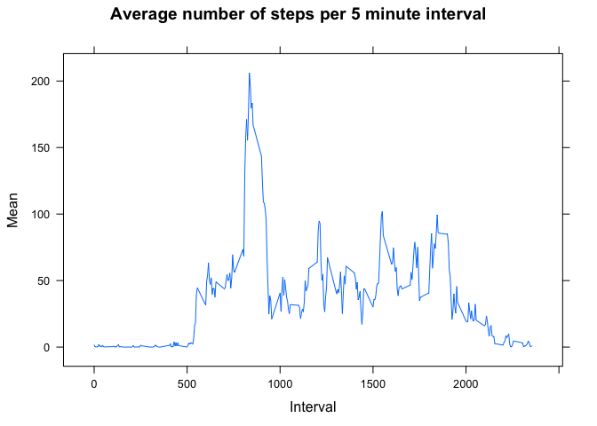
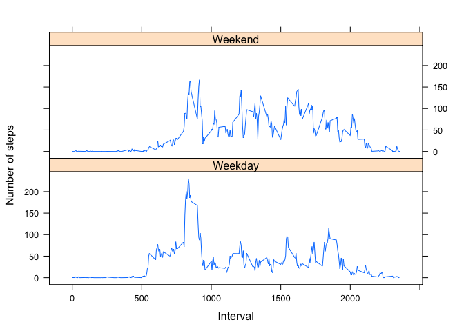

# Reproducible Research: Peer Assessment 1

## Load required libraries

```r
library(lattice)
```
## Loading and preprocessing the data

*1. Data Load from csv*

```r
# data load
actdata <- read.csv("activity.csv")

# check structure of data 
str(actdata)
```

```
## 'data.frame':	17568 obs. of  3 variables:
##  $ steps   : int  NA NA NA NA NA NA NA NA NA NA ...
##  $ date    : Factor w/ 61 levels "2012-10-01","2012-10-02",..: 1 1 1 1 1 1 1 1 1 1 ...
##  $ interval: int  0 5 10 15 20 25 30 35 40 45 ...
```

*2. Preprocessing*

```r
# convert interval data to time
actdata$date<- strptime(actdata$date, format= "%Y-%m-%d")
actdata$date <- as.Date(actdata$date, "%Y-%m-%d")

# Make a new variable called Day 
actdata$DayOfWeek <- as.factor(weekdays(actdata$date))

#Make a new variable corresponding to weekday/weekend
actdata$WeekdayWeekend[as.character(actdata$DayOfWeek) %in% c("Saturday", "Sunday")] <- "Weekend"
actdata$WeekdayWeekend[!(as.character(actdata$DayOfWeek) %in% c("Saturday", "Sunday"))] <- "Weekday"
actdata$WeekdayWeekend <- as.factor(actdata$WeekdayWeekend)
```
*Data audit of processed data*

```r
str(actdata)
```

```
## 'data.frame':	17568 obs. of  5 variables:
##  $ steps         : int  NA NA NA NA NA NA NA NA NA NA ...
##  $ date          : Date, format: "2012-10-01" "2012-10-01" ...
##  $ interval      : int  0 5 10 15 20 25 30 35 40 45 ...
##  $ DayOfWeek     : Factor w/ 7 levels "Friday","Monday",..: 2 2 2 2 2 2 2 2 2 2 ...
##  $ WeekdayWeekend: Factor w/ 2 levels "Weekday","Weekend": 1 1 1 1 1 1 1 1 1 1 ...
```

```r
head(actdata)
```

```
##   steps       date interval DayOfWeek WeekdayWeekend
## 1    NA 2012-10-01        0    Monday        Weekday
## 2    NA 2012-10-01        5    Monday        Weekday
## 3    NA 2012-10-01       10    Monday        Weekday
## 4    NA 2012-10-01       15    Monday        Weekday
## 5    NA 2012-10-01       20    Monday        Weekday
## 6    NA 2012-10-01       25    Monday        Weekday
```

```r
table(actdata$DayOfWeek,actdata$WeekdayWeekend)
```

```
##            
##             Weekday Weekend
##   Friday       2592       0
##   Monday       2592       0
##   Saturday        0    2304
##   Sunday          0    2304
##   Thursday     2592       0
##   Tuesday      2592       0
##   Wednesday    2592       0
```

## What is mean total number of steps taken per day?
We are told to ignore the missing values for this section, so I subsetted the actdata to the rows with steps not NA using complete.cases


```r
SubsetData<-actdata[complete.cases(actdata$steps),]
```
*1. Calculate the total number of steps per day*

```r
AggDataByDay <-aggregate(SubsetData$steps, by=list(SubsetData$date), FUN=sum, na.rm=TRUE)
```

*2. Make a histogram of the total number of steps taken each day*

```r
hist(AggDataByDay$x, breaks=10, main="Histogram of total number of steps per day", xlab="number of steps")
```

 

*3. Calculate and report the mean and median of the total number of steps taken per day*

**Mean total number of steps per day**

```r
mean(AggDataByDay$x)
```

```
## [1] 10766.19
```

**Median total number of steps per day**


```r
median(AggDataByDay$x)
```

```
## [1] 10765
```
## What is the average daily activity pattern?

*1. Make a time series plot (i.e. type = "l") of the 5-minute interval (x-axis) and the average number of steps taken, averaged across all days (y-axis)*


```r
MeanByInterval <-aggregate(SubsetData$steps, by=list(SubsetData$interval), FUN=mean, na.rm=TRUE)
names(MeanByInterval)<- c("Interval","Mean")
xyplot(Mean ~ Interval, MeanByInterval,type="l", main="Average number of steps per 5 minute interval")
```

 


*2. Which 5-minute interval, on average across all the days in the dataset, contains the maximum number of steps?*

```r
MeanByInterval$Interval[which.max(MeanByInterval$Mean)]
```

```
## [1] 835
```
## Imputing missing values

*1. Calculate and report the total number of missing values in the dataset (i.e. the total number of rows with NAs)*


```r
nrow(actdata[!(complete.cases(actdata)),])
```

```
## [1] 2304
```

*2. Devise a strategy for filling in all of the missing values in the dataset. The strategy does not need to be sophisticated. For example, you could use the mean/median for that day, or the mean for that 5-minute interval, etc.*

I have decided to use the mean for the relevant five minute interval. 

*3. Create a new dataset that is equal to the original dataset but with the missing data filled in.*


```r
# Get the row numbers of values to 
tobeimputed <- which(is.na(actdata$steps))
str(tobeimputed)
```

```
##  int [1:2304] 1 2 3 4 5 6 7 8 9 10 ...
```

```r
# copy actdata to ImputedData
ImputedData <- actdata 

# summarise the step data before imputation
summary(actdata$steps)
```

```
##    Min. 1st Qu.  Median    Mean 3rd Qu.    Max.    NA's 
##    0.00    0.00    0.00   37.38   12.00  806.00    2304
```

```r
# Impute the step data as the mean for that interval
for (i in tobeimputed){
        ImputedData$steps[i] <- MeanByInterval$Mean[match(ImputedData$interval[i], MeanByInterval$Interval)]
}        
 
# summarise the step data post imputation        
summary(ImputedData$steps)
```

```
##    Min. 1st Qu.  Median    Mean 3rd Qu.    Max. 
##    0.00    0.00    0.00   37.38   27.00  806.00
```
We now have no NAs in the number of steps column in the imputed data set.

*4. Make a histogram of the total number of steps taken each day and calculate and report the mean and median total number of steps taken per day.*


```r
SumDataByDay <-aggregate(ImputedData$steps, by=list(ImputedData$date), FUN=sum, na.rm=TRUE)
```


```r
hist(SumDataByDay$x, breaks=10, main="Histogram of total number of steps per day", xlab="number of steps")
```

 


**Mean total number of steps per day**

```r
mean(AggDataByDay$x)
```

```
## [1] 10766.19
```

**Median total number of steps per day**

```r
median(AggDataByDay$x)
```

```
## [1] 10765
```


*Do these values differ from the estimates from the first part of the assignment? What is the impact of imputing missing data on the estimates of the total daily number of steps?*

The values are similar to those obtained for the unimputed data set (ignoring the NAs).  This is good because we don't want the imputation to alter the distribution of the dataset.  

## Are there differences in activity patterns between weekdays and weekends?

*1. Create a new factor variable in the dataset with two levels – “weekday” and “weekend” indicating whether a given date is a weekday or weekend day.*

This was done as part of the preprocesssing - see above.  Here's a summary of the variable.  


```r
summary(ImputedData$WeekdayWeekend)
```

```
## Weekday Weekend 
##   12960    4608
```
*2. Make a panel plot containing a time series plot (i.e. type = "l") of the 5-minute interval (x-axis) and the average number of steps taken, averaged across all weekday days or weekend days (y-axis).*


```r
MeanByDayType <-aggregate(ImputedData$steps, by=list(ImputedData$interval,ImputedData$WeekdayWeekend), FUN=mean, na.rm=TRUE)
names(MeanByDayType)<-c("Interval", "DayType","Mean")

xyplot(Mean ~ Interval | DayType, MeanByDayType, 
       type="l", 
       lwd=1, 
       xlab="Interval", 
       ylab="Number of steps", 
       layout=c(1,2))
```

 

We can see by the panel plot above that there is less activity in the mornings on weekends - perhaps this individual likes to sleep in on weekends?
